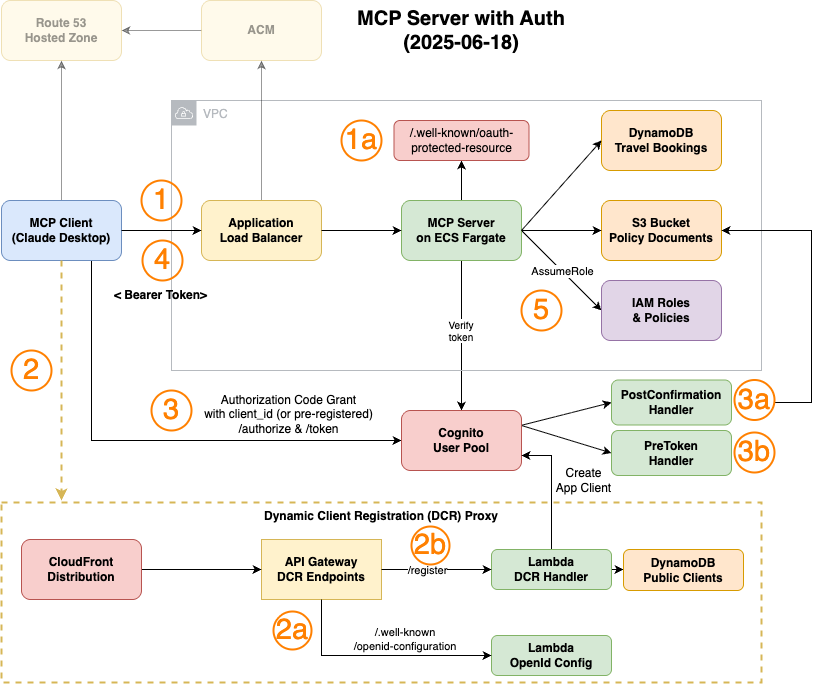

# MCP Server

A Model Context Protocol (MCP) server implementation for B2B travel booking with authentication and authorization via Amazon Cognito and OAuth 2.1.

## Overview

**Technology Stack:**
- Node.js with Express and MCP SDK
- AWS services: ECS, DynamoDB, S3, Cognito
- **RFC 9728** Protected Metadata Resource 
- **RFC 7591** Dynamic client registration
- **RFC 8414** OpenID Configuration endpoint to advertise the endpoint
- Multi-tenant architecture with data isolation

**Key Features:**
- Travel booking tools (flights, hotels, loyalty programs)
- Secure JWT authentication with scope-based authorization
- Multi-tenant data isolation
- Containerized deployment on ECS Fargate

## Architecture



### Architecture Flow

This diagram illustrates how the Model Context Protocol (MCP) Server handles secure, multi-tenant authentication and data access in AWS. Here's the detailed flow:

#### Authentication Flow (Steps 1-3)

**Step 1: Unauthenticated request and protected resource metadata discovery**

- MCP Client makes unauthenticated request to MCP Server. The server returns **with 401 Unauthorized** and `WWW-Authenticate` header pointing to `/.well-known/oauth-protected-resource`. The client retrieves that Protected Resource Metadata document (1a) from the MCP server and discovers the configured authorization_servers, authentication methods and scopes that are supported. The `authorization_servers` entry points to the Dynamic Client Registration (DCR) Cloudfront Proxy.  


**Step 2: OAuth with Dynamic Client Registration (DCR) proxy**
- Client gets Authorization Server Metadata (2a) from authorization_server`/.well-known/openid-configuration` (or `/.well-known/oauth-authorization-server`). Since Cognito's default `/.well-known/openid_configuration` can't be customized we provide our own via the proxy. This is needed for DCR in step 2b. If you want to skip DCR you can manually create a Cognito App Client and provide the client_id and client_secret initially.
- Clients **optionally** can use Dynamic Client Registration (DCR) (2b) to automatically register their client with the OAuth provider. This requires a **custom OpenID configuration** (2a) that includes the DCR endpoint in the `registration_endpoint` field. The public clients will get created as Cognito application clients and are tracked in a separate DynamoDB table (See [DCR Security considerations](#dynamic-client-registration-dcr-security)).

**Step 3: Multi-Tenant Cognito Customization**
- After the client obtains client_id it can now start the Authorization Code Grant to get the access token. This will involve redirection to the Amazon Cognito Hosted UI and callbacks.
- Upon first user registration (3a) a Lambda `PostConfirmation` trigger automatically creates a custom claim `custom:tenantId` with a tenant extracted from the email alias user+tenant1@example.com. (See [User Signup and Tenant Assignment](#user-signup-and-tenant-assignment))
- The `custom:tenantId`claim will be included in the access token via a Lambda `PreToken` trigger (3b).

**Step 4: MCP Server Access**
- After obtaining a valid JWT Bearer access token, the MCP client can now make authenticated calls to the MCP server

**Step 5: Role-Based Authorization**
- MCP Server verifies the JWT with Amazon Cognito (jwk)
- MCP Server extracts `custom:tenantId` from the JWT
- MCP Server makes `AssumeRole` call using the `tenantId` as a session tag to obtain temporary AWS credentials 
- The session tags enforce tenant isolation through policy conditions for DynamoDB (`dynamodb:LeadingKeys: ["${aws:PrincipalTag/tenantId}"]`) and Amazon S3 (`s3:prefix: ["${aws:PrincipalTag/tenantId}/*"]` )
- Tenant-enforced MCP resources and tools can now be accessed 

### Deployment Architecture

The system uses a two-stack CDK deployment:
- **Infrastructure Stack**: DynamoDB, S3, Cognito, IAM roles
- **Application Stack**: ECS Fargate, ALB, VPC, networking

### OAuth and Dynamic Client Registration

The server project includes a custom implementation of [Dynamic Client Registration (DCR)](https://tools.ietf.org/html/rfc7591) for Amazon Cognito that provides:

- **RFC 7591** dynamic client registration
- **RFC 8414** OpenID Configuration endpoint to advertise the endpoint
- **Seamless integration** with the MCP Server's Cognito User Pool

### Current Limitations and Workarounds

The current implementation includes several temporary workarounds to ensure compatibility with existing MCP clients:

1. **OAuth Endpoint Support**: The infrastructure includes a `/.well-known/oauth-authorization-server` endpoint specifically for Claude Desktop and other older MCP clients that haven't yet been updated to fallback to  `/.well-known/openid-configuration` endpoint. This workaround was largely addressed in [MCP TypeScript SDK PR #652](https://github.com/modelcontextprotocol/typescript-sdk/pull/652).

2. **CloudFront Path Rewriting**: A CloudFront distribution is deployed in front of the API Gateway to remove the `/prod` path prefix from URLs. This is necessary because older MCP clients (including Claude Desktop) don't handle API Gateway stage paths correctly. This limitation was also mostly resolved in the same SDK update.

3. **Custom OpenID Configuration**: Since Amazon Cognito doesn't allow customization of its built-in OpenID Configuration endpoint, we provide our own implementation to support Dynamic Client Registration features required by MCP clients. Essentially setting `registration_endpoint`.

4. **Custom Dynamic Client Registration**: Amazon Cognito doesn't provide Dynamic Client Registration (DCR) capabilities out of the box, so we implement a custom RFC 7591 DCR endpoint. DCR is needed to allow MCP clients to automatically register themselves with the OAuth provider without manual client configuration, enabling seamless authentication flows for distributed MCP deployments.

These workarounds ensure backward compatibility while the MCP ecosystem transitions to newer client implementations. 1 and 2 can be removed once all target clients have been updated to support standard OAuth endpoints and paths.

## Quick Start

```bash
cd infra
npm install
./deploy.sh

# Run full OAuth Flow (Optional) or start Inspector / connect to Claude
export MCP_SERVER_URL=<YOUR_SERVER>
node oauth_flow_unified.js
```

## Multi-Tenant Security

- **Tenant ID**: Extracted from JWT `custom:tenantId` claim
- **Data Isolation**: DynamoDB partition keys prefixed with tenant ID
- **STS Tagging**: AWS credentials tagged with tenant context
- **Scope Validation**: Tools check required OAuth scopes

### User Signup and Tenant Assignment

When users sign up and confirm their email, the system automatically assigns tenant information through a Cognito post-confirmation trigger:

#### Email Alias-Based Tenant Assignment
Users can specify their tenant by using email aliases during signup:
- **Format**: `user+tenantname@example.com`
- **Example**: `john+acmecorp@example.com` → Tenant ID: `acmecorp`
- **Tier**: Users with aliases are assigned `standard` tier
- **Resources**: Sample travel policies are uploaded to S3 under the tenant prefix

#### Fallback Tenant Generation
If no alias is provided, the system generates a unique tenant ID:
- **Format**: `TENANT_{timestamp}_{random}`
- **Example**: `TENANT_L8X9K2_A7B3F1`
- **Tier**: Auto-generated tenants receive `basic` tier

### ⚠️ Security Disclaimer

**This tenant assignment mechanism is for DEMO PURPOSES ONLY and should NOT be used in production environments.**

**Security Issues:**
- **No Tenant Ownership Validation**: Anyone can claim any tenant name using email aliases
- **Tenant Impersonation**: Users can access other tenants' data by using their tenant name in email aliases
- **No Access Control**: No verification that users have legitimate access to claimed tenants

**Production Recommendations:**
- Implement proper tenant invitation/approval workflows
- Use secure tenant assignment through admin interfaces
- Validate tenant membership through external identity providers
- Implement tenant-specific user pools or proper RBAC systems

### Dynamic Client Registration (DCR) Security

The DCR implementation uses a DynamoDB table (`MCPServerPublicClients`) to securely track public OAuth clients, preventing exposure of confidential client information.

**Security Features:**
- **Public Clients Only**: Only stores and retrieves public clients (no client secrets)
- **Base64url Encoding**: URI encoding prevents DynamoDB key character issues
- **Fast Lookups**: Sub-10ms response vs 100-500ms Cognito pagination
- **Minimal Storage**: Only stores lookup keys and client IDs

**Table Schema:**
```json
{
  "clientKey": "MyApp#aHR0cHM6Ly9hcHAuY29tL2NiLGh0dHA6Ly9sb2NhbGhvc3Q6MzAwMC9jYg",
  "clientId": "1a2b3c4d5e6f7g8h9i0j",
  "createdAt": "2024-01-15T10:30:00.000Z"
}
```

Please note that if you register a public client with a localhost redirect_uri that is already registered, the client_id already registered for this redirect_uri will be returned.
As defined in [RFC9700](https://datatracker.ietf.org/doc/rfc9700/), we recommend that you enforce PKCE in those use cases at least.

## Directory Structure

- **[src/](./src/README.md)** - MCP server implementation, tools, and development workflow
- **[infra/](./infra/README.md)** - CDK infrastructure code and deployment options

## Development

1. Deploy infrastructure: `cd infra && ./deploy.sh --infrastructure-only`
2. Set up local environment: See [src/README.md](./src/README.md#local-environment-setup)
3. Run locally: `cd src && npm start`
