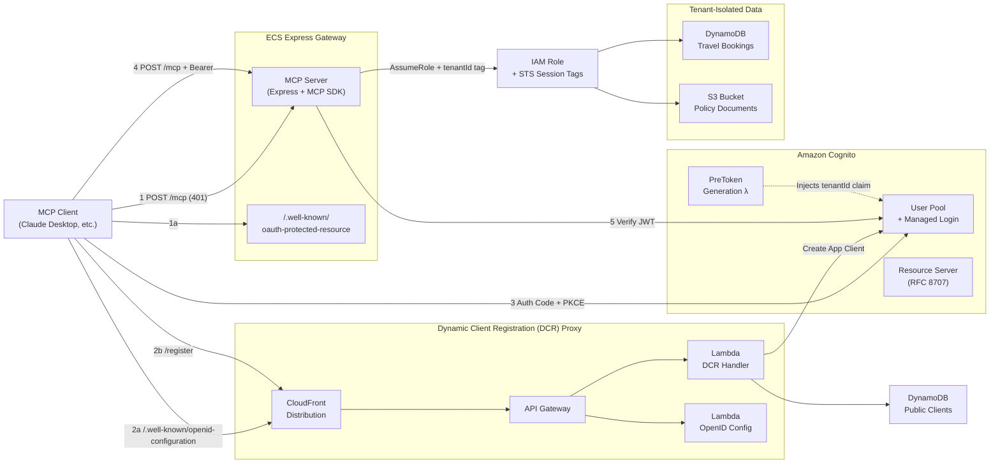
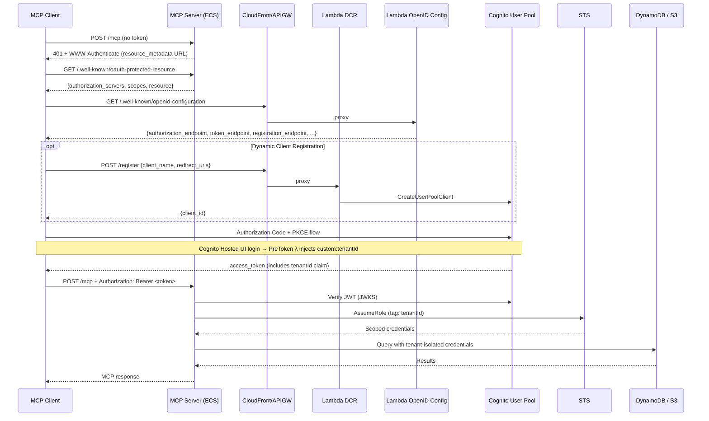

# MCP Server

A Model Context Protocol (MCP) server implementation for B2B travel booking with authentication and authorization via Amazon Cognito and OAuth 2.1.

## Overview

**Technology Stack:**
- Node.js with Express and MCP SDK
- AWS services: ECS, DynamoDB, S3, Cognito
- Multi-tenant architecture with data isolation
- **RFC 9728** Protected Metadata Resource 
- **RFC 7591** Dynamic client registration
- **RFC 8414** OpenID Configuration endpoint to advertise the endpoint

**Key Features:**
- Travel booking tools (flights, hotels, loyalty programs)
- Secure JWT authentication with scope-based authorization
- Multi-tenant data isolation
- Containerized deployment on ECS Fargate

## Architecture

### Component Topology


```mermaid
flowchart LR
  Client["MCP Client<br/>(Claude Desktop, etc.)"]

  subgraph ECS["ECS Express Gateway"]
    MCP["MCP Server<br/>(Express + MCP SDK)"]
    OPR["/.well-known/<br/>oauth-protected-resource"]
  end

  subgraph DCR_Proxy["Dynamic Client Registration (DCR) Proxy"]
    CF["CloudFront<br/>Distribution"]
    APIGW["API Gateway"]
    LambdaDCR["Lambda<br/>DCR Handler"]
    LambdaOIDC["Lambda<br/>OpenID Config"]
  end

  subgraph Cognito["Amazon Cognito"]
    UP["User Pool<br/>+ Managed Login"]
    RS["Resource Server<br/>(RFC 8707)"]
    PreToken["PreToken<br/>Generation λ"]
  end

  subgraph Data["Tenant-Isolated Data"]
    DDB["DynamoDB<br/>Travel Bookings"]
    S3["S3 Bucket<br/>Policy Documents"]
  end

  IAM["IAM Role<br/>+ STS Session Tags"]
  DDBClients["DynamoDB<br/>Public Clients"]

  Client -->|"1 POST /mcp (401)"| MCP
  Client -->|"1a"| OPR
  Client -->|"2a /.well-known/openid-configuration"| CF
  Client -->|"2b /register"| CF
  Client -->|"3 Auth Code + PKCE"| UP
  Client -->|"4 POST /mcp + Bearer"| MCP

  CF --> APIGW
  APIGW --> LambdaDCR
  APIGW --> LambdaOIDC
  LambdaDCR -->|"Create App Client"| UP
  LambdaDCR --> DDBClients

  MCP -->|"5 Verify JWT"| UP
  MCP -->|"AssumeRole + tenantId tag"| IAM
  IAM --> DDB
  IAM --> S3

  PreToken -.->|"Injects tenantId claim"| UP
```

### Authentication & Authorization Sequence


```mermaid
sequenceDiagram
  participant C as MCP Client
  participant M as MCP Server (ECS)
  participant CF as CloudFront/APIGW
  participant DCR as Lambda DCR
  participant OIDC as Lambda OpenID Config
  participant Cog as Cognito User Pool
  participant STS as STS
  participant Data as DynamoDB / S3

  C->>M: POST /mcp (no token)
  M-->>C: 401 + WWW-Authenticate (resource_metadata URL)

  C->>M: GET /.well-known/oauth-protected-resource
  M-->>C: {authorization_servers, scopes, resource}

  C->>CF: GET /.well-known/openid-configuration
  CF->>OIDC: proxy
  OIDC-->>C: {authorization_endpoint, token_endpoint, registration_endpoint, ...}

  opt Dynamic Client Registration
    C->>CF: POST /register {client_name, redirect_uris}
    CF->>DCR: proxy
    DCR->>Cog: CreateUserPoolClient
    DCR-->>C: {client_id}
  end

  C->>Cog: Authorization Code + PKCE flow
  Note over C,Cog: Cognito Hosted UI login → PreToken λ injects custom:tenantId
  Cog-->>C: access_token (includes tenantId claim)

  C->>M: POST /mcp + Authorization: Bearer <token>
  M->>Cog: Verify JWT (JWKS)
  M->>STS: AssumeRole (tag: tenantId)
  STS-->>M: Scoped credentials
  M->>Data: Query with tenant-isolated credentials
  Data-->>M: Results
  M-->>C: MCP response
```

### Architecture Flow

This diagram illustrates how the Model Context Protocol (MCP) Server handles secure, multi-tenant authentication and data access in AWS. Here's the detailed flow:

#### Authentication Flow (Steps 1-3)

**Step 1: Unauthenticated request and protected resource metadata discovery**

- MCP Client makes unauthenticated request to MCP Server. The server returns **with 401 Unauthorized** and `WWW-Authenticate` header pointing to `/.well-known/oauth-protected-resource`. The client retrieves that Protected Resource Metadata document (1a) from the MCP server and discovers the configured authorization_servers, authentication methods and scopes that are supported. The `authorization_servers` entry points to the Dynamic Client Registration (DCR) Cloudfront Proxy.  


**Step 2: OAuth with Dynamic Client Registration (DCR) proxy**
- Client gets Authorization Server Metadata (2a) from authorization_server`/.well-known/openid-configuration` (or `/.well-known/oauth-authorization-server`). Since Cognito's default `/.well-known/openid_configuration` can't be customized we provide our own via the proxy. This is needed for DCR in step 2b. If you want to skip DCR you can manually create a Cognito App Client and provide the client_id and client_secret initially.
- Clients **optionally** can use Dynamic Client Registration (DCR) (2b) to automatically register their client with the OAuth provider. This requires a **custom OpenID configuration** (2a) that includes the DCR endpoint in the `registration_endpoint` field. The public clients will get created as Cognito application clients and are tracked in a separate DynamoDB table (See [Dynamic Client Registration](#oauth-and-dynamic-client-registration-dcr)).

**Step 3: Multi-Tenant Cognito Customization**
- After the client obtains client_id it can now start the Authorization Code Grant to get the access token. This will involve redirection to the Amazon Cognito Managed Login UI and callbacks.
- Users are created by an admin via `manage-users.js`, which assigns `custom:tenantId` from the email alias (e.g. user+tenant1@example.com). Self-registration is disabled. (See [User Management](#user-management))
- The `custom:tenantId` claim will be included in the access token via a `PreTokenGeneration` Lambda trigger (V2_0).

**Step 4: MCP Server Access**
- After obtaining a valid JWT Bearer access token, the MCP client can now make authenticated calls to the MCP server

**Step 5: Role-Based Authorization**
- MCP Server verifies the JWT with Amazon Cognito (jwk)
- MCP Server extracts `custom:tenantId` from the JWT
- MCP Server makes `AssumeRole` call using the `tenantId` as a session tag to obtain temporary AWS credentials 
- The session tags enforce tenant isolation through policy conditions for DynamoDB (`dynamodb:LeadingKeys: ["${aws:PrincipalTag/tenantId}"]`) and Amazon S3 (`s3:prefix: ["${aws:PrincipalTag/tenantId}/*"]` )
- Tenant-enforced MCP resources and tools can now be accessed 

### Deployment Architecture

The system uses a two-stack CDK deployment:
- **Infrastructure Stack**: DynamoDB (bookings + public clients), S3, Cognito (User Pool + Resource Server), IAM roles, DCR Lambda, OpenID Config Lambda, API Gateway, CloudFront
- **Application Stack**: ECS Express Gateway service (public HTTPS endpoint, no ALB/VPC needed), ECR image, Cognito Resource Server registration (RFC 8707)

### OAuth and Dynamic Client Registration (DCR)

The sample includes a custom implementation of [Dynamic Client Registration (DCR)](https://tools.ietf.org/html/rfc7591) for Amazon Cognito. It also provides a separate **RFC 8414** OpenID Configuration endpoint to advertise the **registration_endpoint**. 

The DCR endpoint is implemented via a custom AWS Lambda function. It creates app clients via the Amazon Cognito API and keeps track of the clients in a DynamoDB table. During creation the function first checks if the (to be registered) app client already exists based on the **client_name** and **redirect_uri**. This prevents the creation of new app clients for every registration request and provides a single client_id per application client (Claude Desktop, Quick Suite, MCP Inspector etc.).

**Features:**
- **Public Clients Only**: Only stores and retrieves public clients (no client secrets)
- **Base64url Encoding**: URI encoding prevents DynamoDB key character issues
- **Cached clients**: Sub-10ms response from DynamoDB vs 100-500ms Cognito pagination

**Table Schema:**
```json
{
  "clientKey": "MyApp#aHR0cHM6Ly9hcHAuY29tL2NiLGh0dHA6Ly9sb2NhbGhvc3Q6MzAwMC9jYg",
  "clientId": "1a2b3c4d5e6f7g8h9i0j",
  "createdAt": "2024-01-15T10:30:00.000Z"
}
```

Please note that if you register a public client with a localhost redirect_uri that is already registered, the client_id already registered for this redirect_uri will be returned. As defined in [RFC9700](https://datatracker.ietf.org/doc/rfc9700/), we recommend that you enforce PKCE in those use cases at least. In addition, the current specification requires the DCR endpoint to be public. We therefore apply a conservative rate-limit on the DCR endpoint.  

### Current Limitations and Workarounds

The current implementation includes several temporary workarounds to ensure compatibility with existing MCP clients:

1. **OAuth Endpoint Support**: The infrastructure includes a `/.well-known/oauth-authorization-server` endpoint specifically for Claude Desktop and other older MCP clients that haven't yet been updated to fallback to  `/.well-known/openid-configuration` endpoint. This workaround was largely addressed in [MCP TypeScript SDK PR #652](https://github.com/modelcontextprotocol/typescript-sdk/pull/652).

2. **CloudFront Path Rewriting**: A CloudFront distribution is deployed in front of the API Gateway to remove the `/prod` path prefix from URLs. This is necessary because older MCP clients (including Claude Desktop) don't handle API Gateway stage paths correctly. This limitation was also mostly resolved in the same SDK update.

3. **Custom OpenID Configuration**: Since Amazon Cognito doesn't allow customization of its built-in OpenID Configuration endpoint, we provide our own implementation to support Dynamic Client Registration features required by MCP clients. Essentially setting `registration_endpoint`.

4. **Custom Dynamic Client Registration**: Amazon Cognito doesn't provide Dynamic Client Registration (DCR) capabilities out of the box, so we implement a custom RFC 7591 DCR endpoint. DCR is needed to allow MCP clients to automatically register themselves with the OAuth provider without manual client configuration, enabling seamless authentication flows for distributed MCP deployments.

These workarounds ensure backward compatibility while the MCP ecosystem transitions to newer client implementations. 1 and 2 can be removed once all target clients have been updated to support standard OAuth endpoints and paths.

## Quick Start

```bash
cd infra
npm install
./deploy.sh

# Run end-to-end test (optional)
cd ../src
MCP_SERVER_URL=<YOUR_SERVER> TEST_USERNAME='user+tenant@example.com' TEST_PASSWORD='password' npm run test:e2e
```

## Multi-Tenant Security

- **Tenant ID**: Extracted from JWT `custom:tenantId` claim
- **Data Isolation**: DynamoDB partition keys prefixed with tenant ID
- **STS Tagging**: AWS credentials tagged with tenant context
- **Scope Validation**: Tools check required OAuth scopes

### User Management

Users are created by an administrator via the `manage-users.js` script. Self-registration is disabled.

```bash
cd scripts

# Auto-resolves User Pool ID and S3 bucket from CloudFormation stack outputs
node manage-users.js create <username> <email>
node manage-users.js list
node manage-users.js delete <username>
```

#### Email Alias-Based Tenant Assignment
Tenant is derived from the email alias:
- **Format**: `user+tenantname@example.com`
- **Example**: `john+acmecorp@example.com` → Tenant ID: `acmecorp`, Tier: `standard`
- If no alias is provided, a unique tenant ID is generated (`TENANT_{timestamp}_{random}`, Tier: `basic`)

The script also uploads sample travel policy files to S3 under the tenant prefix.

### ⚠️ Security Disclaimer

**This tenant assignment mechanism is for DEMO PURPOSES ONLY and should NOT be used in production environments.**

**Security Issues:**
- **No Tenant Ownership Validation**: An admin can assign any tenant name via email alias without external verification
- **No Access Control**: No verification that the assigned tenant corresponds to a legitimate organization

**Production Recommendations:**
- Implement proper tenant invitation/approval workflows
- Use secure tenant assignment through admin interfaces
- Validate tenant membership through external identity providers
- Implement tenant-specific user pools or proper RBAC systems

## Directory Structure

- **[src/](./src/README.md)** - MCP server implementation, tools, and development workflow
- **[infra/](./infra/README.md)** - CDK infrastructure code and deployment options

## Development

1. Deploy infrastructure: `cd infra && ./deploy.sh --infrastructure-only`
2. Set up local environment: See [src/README.md](./src/README.md#local-environment-setup)
3. Run locally: `cd src && npm start`
